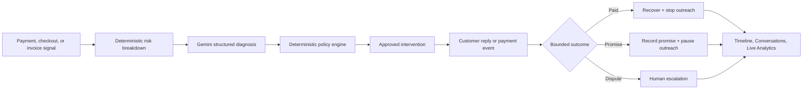

# DuesPilot

> A bounded AI workflow for finding revenue at risk, understanding customer replies, selecting a safe recovery action, and proving the outcome.

DuesPilot is a full-stack B2B revenue-recovery product. AI understands unstructured customer language; deterministic policy controls actions that affect money, customer outreach, and escalation.

```text
Revenue signal → explainable risk score → Gemini diagnosis → policy-bound action
→ customer outcome → stop / escalate → audit trail + conversations + analytics
```

## Engineering and features

### Recovery engine

- Stateful FastAPI recovery engine for B2B invoices and payment journeys.
- Deterministic, explainable risk score capped at 100.
- Policy engine that selects approved actions and cannot be overridden by AI.
- Idempotent payment and promise-to-pay handlers: replayed events do not double-count money or duplicate audit records.
- Durable local SQLite recovery store: cases, outcomes, and audit events survive an application restart.
- Resettable fictional-data adapter for a reliable demonstration.

### Bounded AI diagnosis

- Gemini structured classification for free-form customer replies.
- Validated output: `cause`, `confidence`, `reasoning`, and `source` only.
- Gemini cannot recommend, execute, or bypass a recovery action.
- Transparent deterministic fallback when Gemini is disabled or unavailable.
- Each diagnosis is added to the audit timeline, then the deterministic risk and policy engine recalculates the intervention.
- Diagnoses below 70% confidence are explicitly routed to human review; no automated outreach can continue.

### Recovery controls

- Maximum automated attempts: **3**.
- Maximum voice calls per day: **1**.
- Automated outreach stops after payment, opt-out, or a valid promise-to-pay.
- Disputes, failed promises, repeated failures, and high-value cases route to human escalation.
- Exact approved message and safeguard are visible before an action is executed.

### Product experience

- Revenue dashboard with at-risk, recovered, open-case, promise, and escalation metrics.
- Case view with risk breakdown, policy explanation, action preview, Gemini diagnosis, and audit timeline.
- Hinglish recovery dialer simulation, clearly labelled; it never calls a real number.
- Conversations page with simulated-call outcomes.
- Live analytics which update from the current demonstration run.
- Scenario Lab for payment degradation, checkout abandonment, failed subscriptions, and mandate retry—all using the shared engine and policy.
- 60-reply synthetic diagnosis evaluation with per-cause accuracy, source/fallback counts, and a saved reproducible report.
- Reproducible 72-invoice synthetic batch benchmark, separate from interactive cases and clearly labelled as an assumption model—not real merchant performance.

### Access control

- Browser-local demo roles for a no-credential presentation.
- Optional Supabase email/password authentication for production use.
- Backend JWT validation when `AUTH_REQUIRED=true`.
- Server-enforced administrator boundary for every state-changing recovery endpoint.
- Supabase migration for profiles and row-level security.

## Architecture

For the complete as-built architecture, domain model, policy precedence, AI boundary, persistence design, API contract, authentication model, evaluation methodology, failure modes, security posture, tradeoffs, deployment path, and technical debt, read the [Engineering Design](docs/ENGINEERING_DESIGN.md).



## Explainable risk score

The score is field-derived, stored with its full breakdown, and never controlled by the LLM.

| Signal | Contribution |
|---|---:|
| Event severity: payment failure / checkout abandonment / invoice dispute | +20 / +10 / +25 |
| Days overdue | `min(30, days × 1.5)` |
| Amount tier: ≥₹75k / ≥₹40k / ≥₹10k | +29 / +20 / +10 |
| Prior failed attempts | +8 each, capped at +16 |
| Previous promise missed | +15 |
| Historical payment delay | +8 |
| Low responsiveness | +8 |

Every contribution, including zero-point signals, is shown on the case screen for auditability.

## Demo flow

1. Open **Dashboard** and select **Aarav Mehta** (₹84,500 at risk).
2. Show score breakdown, cause, approved intervention, and safeguards.
3. In **Bounded AI Diagnosis**, enter: `The payment link failed; our bank is showing a technical error.`
4. Show `Gemini Structured Output`, its classification and explanation, and the updated policy.
5. Open the recovery dialer and choose **Payment complete ho gaya**.
6. Show the closed case, recovered amount, and no-more-outreach stop rule.
7. Open **Conversations** and **Analytics** to prove the same outcome across the system.
8. Optionally use **Scenario Lab** for payment degradation, checkout, subscription, or mandate-retry flows.
9. Open **AI Evaluation**, run the 60-reply synthetic evaluation, and inspect per-cause accuracy plus provider-fallback counts.

## Run locally

Requirements: Python 3.10+ and Node.js 20.19+.

```bash
# Terminal 1
cd Backend
python -m pip install -r requirements.txt
python -m uvicorn main:app --host 127.0.0.1 --port 8000

# Terminal 2
cd Frontend
npm install
npm run dev
```

Open the Vite URL, then visit `/login`.

### Demo accounts

| Role | Sign-in | Permissions |
|---|---|---|
| Administrator | `admin@duespilot.demo` / `Admin@123` | Launch scenarios, reset demo, run actions, and submit AI diagnosis. |
| Recovery analyst | `user@duespilot.demo` / `User@123` | Read-only access to cases, timelines, Conversations, and analytics. |

## Enable Gemini diagnosis

Create `Backend/.env` locally. It is ignored by Git and must never be committed.

```env
GOOGLE_API_KEY=your_gemini_api_key
ENABLE_EXTERNAL_LLM_DIAGNOSIS=true
GEMINI_MODEL_NAME=gemini-2.5-flash
RECOVERY_SQLITE_PATH=data/recovery_demo.sqlite3
```

When configured, the UI displays `Gemini Structured Output`. Without a valid provider response, it displays the deterministic fallback source and continues safely.

## Enable production authentication

The project supports Supabase Auth for real email/password sessions and backend authorization.

1. Create a Supabase project and enable Email/Password authentication.
2. Apply [20260831_role_aware_auth.sql](supabase/migrations/20260831_role_aware_auth.sql).
3. Set deployment secrets:

```env
# Frontend
VITE_SUPABASE_URL=https://your-project.supabase.co
VITE_SUPABASE_ANON_KEY=your-anon-key

# Backend
SUPABASE_URL=https://your-project.supabase.co
SUPABASE_SERVICE_ROLE_KEY=your-service-role-key
AUTH_REQUIRED=true
```

Roles come only from server-managed `app_metadata.recovery_role`. Administrators may mutate recovery workflows; authenticated users are read-only by default.

## Verify

```bash
cd Backend
python -m pytest tests/test_recovery_engine.py -q
python scripts/run_diagnosis_evaluation.py
python scripts/run_recovery_benchmark.py
python scripts/verify_recovery_demo.py

cd ../Frontend
npm run build
```

## API

| Endpoint | Purpose |
|---|---|
| `GET /api/recovery/cases` | List recovery cases |
| `GET /api/recovery/cases/{id}` | View a recovery case |
| `POST /api/recovery/cases/{id}/diagnose` | Gemini/fallback diagnosis, admin only |
| `POST /api/recovery/cases/{id}/execute` | Execute an approved action, admin only |
| `POST /api/recovery/cases/{id}/simulate-call` | Record a simulated call outcome, admin only |
| `POST /api/recovery/demo/payment-webhook` | Validated, idempotent fictional provider-event simulator, admin only |
| `GET /api/recovery/call-summaries` | View conversation outcomes |
| `GET /api/recovery/scenarios` | View scenario catalog |
| `POST /api/recovery/scenarios/{id}/activate` | Launch a scenario, admin only |
| `GET /api/recovery/evaluation` | Read the most recent synthetic diagnosis evaluation |
| `POST /api/recovery/evaluation/run` | Run and save the 60-reply evaluation, admin only |
| `POST /api/recovery/demo/reset` | Reset fictional demo records, admin only |

## Scope and integrity

- All bundled invoices, customer names, phone numbers, calls, and outcomes are fictional.
- The dialer is an in-browser simulation; no real number is called.
- Gemini diagnosis is real when configured, but it is limited to structured classification.
- The benchmark and diagnosis evaluation use reproducible synthetic data, not a claim about real merchant performance.
- The local recovery store is durable SQLite for a single-node demo. A production rollout should use managed Postgres, enforce row-level access to recovery data, consume verified payment webhooks, and use consented communication channels.
