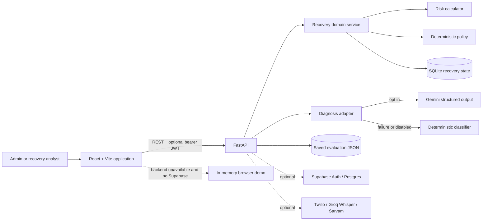
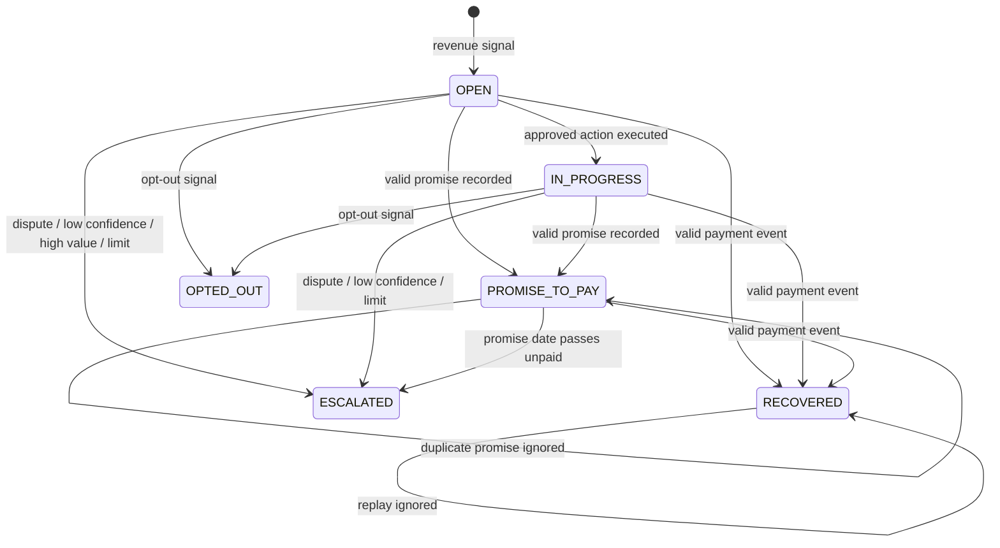
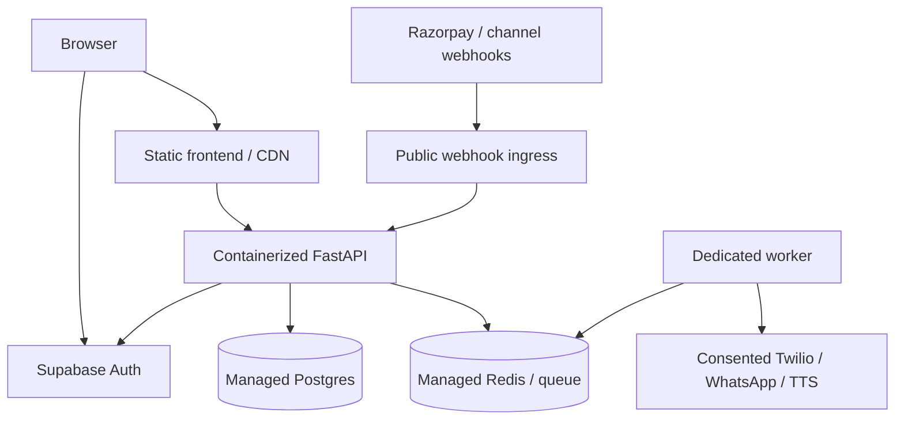

# DuesPilot Engineering Design

**Product:** DuesPilot  
**Track:** AI Revenue Recovery  
**Document type:** As-built technical design and engineering handoff  
**Implementation baseline:** `74f52d8` plus this document  
**Last reviewed:** 2026-09-09

## 1. Executive summary

DuesPilot is a full-stack, offline-capable demonstration of a bounded revenue-recovery agent. It takes a payment, checkout, subscription, mandate, or receivables signal; calculates an explainable risk score; optionally uses Gemini to classify an unstructured customer reply; chooses an intervention through deterministic policy; records a customer outcome; and exposes the result through an audit trail, Conversations, live analytics, a benchmark, and an AI evaluation screen.

The most important architectural decision is the separation between **understanding** and **authority**:

- An LLM may classify text into a small, validated cause taxonomy and attach confidence and reasoning.
- Deterministic code calculates risk, chooses the permitted action, enforces stopping rules, and changes financial workflow state.
- An LLM can never directly send an action, mark money recovered, bypass a stop, or escalate privileges.

This produces a demo that is both reliable enough to present without cloud dependencies and technically defensible: the visible outcome is generated by the same state and policy logic that appears in the audit trail and analytics.

## 2. Scope and implementation-status legend

This repository contains both the focused AI Revenue Recovery vertical slice and an earlier, broader conversational-sales platform. They are deliberately distinguished below.

| Status | Meaning |
|---|---|
| **Core / exercised** | Used by the DuesPilot recovery UI, API, tests, or release-gate demo. |
| **Optional / integrated** | Implemented behind configuration, but the credential-free golden path does not require it. |
| **Foundation / not claimed** | Reusable code exists, but it is not evidence of the current revenue-recovery outcome. |

### 2.1 Core, exercised recovery slice

- React/Vite landing page, authentication shell, dashboard, case view, Conversations, analytics, benchmark, AI Evaluation, and Scenario Lab.
- FastAPI recovery API with validated request models.
- Deterministic risk and policy engine.
- Structured Gemini diagnosis with deterministic fallback.
- Confidence-based human-review boundary.
- Idempotent payment confirmation and promise-to-pay handling.
- Durable single-node SQLite state.
- In-browser Hinglish call simulation with persisted summaries.
- Four recovery scenario templates that reuse the same engine.
- Live current-run analytics.
- Separate 72-invoice synthetic policy benchmark.
- 60-reply synthetic diagnosis evaluation.
- Browser demo roles and optional Supabase authentication/authorization.
- A 22-test recovery suite and an end-to-end release-gate script.

### 2.2 Optional integrations

- Supabase email/password authentication and server-verified user roles.
- Gemini structured-output diagnosis.
- Twilio outbound voice and WhatsApp endpoints.
- Groq Whisper speech-to-text, Groq-compatible conversational generation, and Sarvam text-to-speech.
- Redis-backed call-job infrastructure and Supabase/Postgres data services inherited from the broader platform.

These integrations require credentials and operational setup. The recovery demo does not imply that a real phone number was called or a real WhatsApp message was sent.

### 2.3 Foundation modules not used as proof of recovery

The repository also contains lead ingestion, relationship-manager queues, call recording, RAG, memory, objection handling, scoring, and LangGraph-style orchestration modules. They are useful integration surfaces for a future live deployment, but the current Track 03 proof is the bounded recovery engine in `Backend/services/recovery/`, not the mere presence of those modules.

## 3. Problem statement and design goals

Revenue loss is a sequence, not a single classification problem. A payment can fail, a checkout can be abandoned, a subscription or mandate can fail, an invoice can become overdue, a promised payment can be missed, or a customer can dispute an invoice. A useful system must decide what to do next, act within contact and compliance limits, stop at the correct moment, and prove what happened.

### 3.1 Goals

1. Detect revenue at risk across multiple payment journeys.
2. Make every risk contribution visible and reproducible.
3. Understand natural-language replies without giving probabilistic AI control over money-impacting actions.
4. Select one approved intervention through ordered deterministic policy.
5. Enforce payment, opt-out, promise, contact-frequency, attempt, dispute, value, and confidence boundaries.
6. Keep an append-style audit timeline for every meaningful event.
7. Project the same state into cases, conversations, and analytics.
8. Remain demoable without external APIs while showing when a real provider is in use.
9. Evaluate the AI and recovery assumptions with reproducible, clearly synthetic harnesses.
10. Provide a migration path to managed authentication, storage, webhooks, and communication channels.

### 3.2 Non-goals of the current build

- Claiming recovery uplift on real merchant data.
- Calling real customers from the browser dialer.
- Processing or settling money.
- Treating a simulated payment as a verified Razorpay production webhook.
- Multi-tenant production persistence or distributed locking.
- Letting an LLM autonomously choose or execute a financial action.
- Representing the inherited conversational-sales modules as production-complete Track 03 functionality.

## 4. Design principles

### 4.1 Deterministic authority, probabilistic assistance

AI handles the unstructured boundary: customer language. Code handles risk, policy, authorization, money state, and stop conditions. This is safer, easier to test, and easier to explain to a judge or operator.

### 4.2 One shared case state

The case, timeline, conversation summary, and live analytics derive from the same recovery store. The UI does not independently invent a recovered amount when the backend is available.

### 4.3 Offline-first golden path

External services fail, rate-limit, or lack credentials during demos. The core workflow therefore runs with seeded fictional data, SQLite, and deterministic diagnosis fallback. Provider source labels disclose which path actually ran.

### 4.4 Explicitly bounded automation

Actions are limited by status, cause, confidence, value, attempts, promise state, and voice-call frequency. Terminal or paused cases do not continue outreach.

### 4.5 Honest evidence

All bundled people, companies, invoices, phone numbers, calls, and outcomes are fictional. Benchmark and evaluation screens state that their datasets are synthetic. Their metrics are useful regression and demonstration evidence, not merchant-performance claims.

## 5. System context



### 5.1 Runtime components

| Component | Technology | Responsibility |
|---|---|---|
| Web client | React 19, TypeScript, Vite, Tailwind | Operator workflow, evidence screens, role-aware controls, API projection. |
| API | FastAPI, Pydantic | Validation, authentication dependencies, recovery endpoints, health and inherited platform routes. |
| Domain engine | Plain Python | Scoring, policy, previews, state transitions, idempotency, summaries, synthetic cohorts. |
| Demo persistence | SQLite | Atomically stores case and simulated-call state in one local row. |
| AI diagnosis | Gemini or deterministic fallback | Maps free text to a bounded cause, confidence, reasoning, and source. |
| Auth | Local demo session or Supabase | Presentation login; optional real identity and server-side role enforcement. |
| Evidence harnesses | Python + JSON | Recovery benchmark, diagnosis evaluation, release-gate verification. |
| Optional channels | Twilio, Groq Whisper, Sarvam | Real communication and audio foundation; excluded from the credential-free demo claim. |

## 6. Repository architecture

```text
Backend/
  api/
    auth.py                         Supabase JWT and admin dependencies
    routes/recovery_routes.py       Focused recovery HTTP surface
    routes/*.py                     Broader lead/call/queue platform routes
  services/recovery/
    engine.py                       Domain rules and in-memory reference store
    diagnosis.py                    Gemini adapter, validation, fallback
    evaluation.py                   60-reply evaluation harness
    persistence.py                  SQLite adapter
  services/{llm,stt,tts,telephony}/ Optional conversation/channel foundation
  orchestration/                    Earlier graph-based conversation foundation
  scripts/
    verify_recovery_demo.py         Golden-path release gate
    run_recovery_benchmark.py       Seed-cohort benchmark CLI
    run_diagnosis_evaluation.py     AI evaluation CLI
  tests/test_recovery_engine.py     Maintained recovery test suite

Frontend/src/
  pages/                            Product and evidence screens
  services/recoveryDemo.ts          Recovery API facade + offline browser fallback
  services/demoAuth.tsx             Demo/Supabase auth abstraction
  services/apiService.ts            Axios client and bearer-token attachment
  types/recovery.ts                 Shared frontend domain types

supabase/migrations/
  20260831_role_aware_auth.sql       Profiles, role enum, trigger, and RLS policy
```

## 7. Core domain model

The backend represents a recovery case as a dictionary so the hackathon slice can evolve quickly and serialize directly. The frontend has a corresponding `RecoveryCase` TypeScript interface.

| Field | Meaning / invariant |
|---|---|
| `id` | Stable case identifier. Scenario activation uses `scn-{scenario}-001`. |
| `customer_name`, `invoice_number` | Fictional customer-facing identifiers. |
| `amount` | Integer INR amount; normalized with rounding before financial comparisons. |
| `due_date`, `days_overdue` | Source inputs for ageing and score calculation. |
| `status` | `OPEN`, `IN_PROGRESS`, `PROMISE_TO_PAY`, `ESCALATED`, `RECOVERED`, `STOPPED`, or `OPTED_OUT`. |
| `preferred_language` | Drives preview copy and demo language labels. |
| `phone`, `whatsapp` | Fictional contacts in seeded data. |
| `payment_link` | Fictional payment-link field inserted only into approved templates. |
| `attempts`, `max_attempts` | Contact history and case-specific cap; default cap is 3. |
| `cause`, `cause_confidence` | Normalized diagnosis and confidence. |
| `diagnosis_requires_review` | True below the 0.70 threshold; policy must escalate. |
| `risk_score`, `risk_breakdown`, `risk_reasons` | Derived score, full line items, and concise explanation. |
| `recommended_action`, `recommended_channel`, `policy_reason` | Derived policy output; refreshed after relevant state changes. |
| `action_preview` | Exact deterministic title, channel, body, and safeguard shown before execution. |
| `promise_to_pay_date`, `promise_to_pay_amount`, `next_action_at` | Promise state and scheduled review point. |
| `failed_promise`, `previous_promise_missed` | Escalation and risk signals. |
| `recovered_amount` | Zero until confirmed payment; set to the full case amount in the demo. |
| `processed_payment_event_ids` | Per-case replay protection for provider-style events. |
| `timeline` | Ordered recovery events with title, notes, action, channel, outcome, and UTC timestamp. |
| `demo_data` | Explicit provenance marker for fictional records. |

### 7.1 Derived data rule

`_refresh_policy` is the central recomputation point. It recalculates score, reasons, full score breakdown, policy result, and action preview after a diagnosis or state transition. This prevents stale UI fields from becoming separate sources of truth.

## 8. Recovery lifecycle



### 8.1 Status behavior

| Status | Automation behavior |
|---|---|
| `OPEN` | Policy may approve an intervention. |
| `IN_PROGRESS` | An approved intervention has been recorded; policy is recalculated. |
| `PROMISE_TO_PAY` | Outreach pauses while a valid promise date is active in the primary receivables flow. See the journey-ordering limitation below. |
| `ESCALATED` | Human review is required. |
| `RECOVERED` | Terminal for outreach; action becomes `close`. |
| `STOPPED` / `OPTED_OUT` | Terminal for outreach; action becomes `stop`. |

## 9. Explainable risk scoring

Risk is deterministic and capped at 100:

```text
risk = min(100,
  event severity
  days overdue
  amount tier
  prior failed attempts
  previous promise missed
  historical delay
  low responsiveness)
```

| Signal | Rule | Maximum |
|---|---:|---:|
| Payment-failure severity | +20 | 20 |
| Checkout-abandonment severity | +10 | 10 |
| Invoice-dispute severity | +25 | 25 |
| Other/no event severity | +0 | 0 |
| Days overdue | `min(30, round(days × 1.5))` | 30 |
| Amount ≥ ₹75,000 | +29 | 29 |
| Amount ≥ ₹40,000 and < ₹75,000 | +20 | 20 |
| Amount ≥ ₹10,000 and < ₹40,000 | +10 | 10 |
| Amount < ₹10,000 | +0 | 0 |
| Failed attempts | +8 each, capped at +16 | 16 |
| Previous promise missed | +15 | 15 |
| Historical payment delay ≥ 15 days | +8 | 8 |
| Low responsiveness | +8 | 8 |

Every category is returned, including zero-value categories. The UI shows each line before the total. Event severity is therefore never silently folded into the score.

### 9.1 Example: Aarav Mehta

```text
Event severity — approval delay              +0
Days overdue — 18                           +27
Amount tier — high outstanding amount       +29
Prior failed attempts — 2                   +16
Previous promise missed                     +15
Historical payment delay                     +0
Low customer responsiveness                  +0
------------------------------------------------
Total risk                                   87/100
```

### 9.2 Tradeoff

This is a transparent expert-rule score, not a learned probability of default or recovery. That is correct for the current evidence: the repository has no representative, labelled merchant dataset on which to train or calibrate such a model. Production evolution should version the rule set, back-test it, and later calibrate weights against real outcomes without removing the explanation contract.

## 10. Deterministic policy engine

Policy is evaluated in precedence order. Earlier rules dominate later ones:

1. `RECOVERED` → close, no channel.
2. `STOPPED` or `OPTED_OUT` → stop, no channel.
3. Diagnosis below 70% confidence → human escalation.
4. Invoice dispute → human escalation.
5. Journey-specific scenario action:
   - checkout → time-bound WhatsApp recovery link;
   - subscription → controlled subscription retry;
   - mandate → controlled mandate retry.
6. Active, non-expired promise → pause, no channel.
7. Failed promise or amount ≥ ₹200,000 → human escalation.
8. Attempts ≥ case maximum (default 3) → human escalation.
9. Risk < 40 → low-risk WhatsApp reminder.
10. Risk ≤ 90 with a WhatsApp destination → personalized payment link.
11. Otherwise → voice recovery call.

### 10.1 Why precedence matters

- Payment and opt-out must defeat every growth or recovery objective.
- Uncertain AI must fail closed to a person, not continue automation.
- Disputes are not collection problems and require human handling.
- A valid promise suppresses repeated contact for the primary receivables flow. The current scenario-specific rules are evaluated before the promise rule; that ordering is recorded as technical debt below.
- High-value and exhausted-attempt cases receive higher scrutiny.

### 10.2 Policy-bound content

`build_action_preview` produces the exact title, channel, copy, and safeguard shown before execution. `execute_action` records that approved content in the timeline. The preview and executed audit record therefore come from the same policy result rather than unrelated UI text.

Supported templates include checkout recovery, subscription retry, mandate retry, WhatsApp payment link, WhatsApp reminder, and voice recovery script. A non-automatable policy produces “No automated outreach” with the reason and a human-review safeguard.

### 10.3 Contact limits

- Maximum automated attempts: 3 by default.
- Maximum recorded voice actions per UTC day: 1.
- Reaching either relevant limit routes the case to `ESCALATED`.
- A recovered, stopped, opted-out, or active-promise case disables further operator actions in the UI. Backend policy independently protects the terminal states and the primary receivables promise flow.

In the current implementation, journey-specific `checkout`, `subscription`, and `mandate` policy is selected before the active-promise check. The UI disables action controls because the status is `PROMISE_TO_PAY`, but a direct API call could still receive the journey action. Production policy should move the active-promise rule above all journey-specific actions and add a regression test for every journey.

## 11. AI diagnosis boundary

### 11.1 Allowed output

The diagnosis adapter accepts customer text and returns only:

```json
{
  "cause": "payment failure",
  "confidence": 0.91,
  "reasoning": "Customer reports a bank-side technical failure.",
  "source": "gemini_structured_output"
}
```

Allowed causes are:

- `approval delay`
- `customer unreachable`
- `invoice dispute`
- `payment delay`
- `payment failure`
- `promise missed`
- `unknown`

### 11.2 Provider path

When `ENABLE_EXTERNAL_LLM_DIAGNOSIS=true` and `GOOGLE_API_KEY` is present, the adapter calls the configured Gemini model, currently `gemini-2.5-flash`, with temperature 0 and JSON response mode. The system instruction explicitly forbids action recommendation and invented facts.

### 11.3 Validation

The response is parsed and normalized before entering the domain layer:

- unknown cause labels fall back to the supplied safe cause;
- confidence is converted to a float and clamped to `[0, 1]`;
- reasoning is cleaned and length-bounded;
- the source is assigned by the adapter, not trusted from model output.

The API request itself bounds customer text to 3–2,000 characters. The audit record stores at most 500 characters of the submitted reply.

### 11.4 Safe fallback

If Gemini is disabled, credentials are absent, import/configuration fails, the API errors, JSON is invalid, or a batch is incomplete, a deterministic keyword classifier returns a bounded cause. The source becomes `deterministic_reply_classifier` or `fallback`, so the UI and evaluation report do not pretend an external model ran.

The fallback resolves a known ambiguous phrase before broader keyword matching and uses an ordered keyword taxonomy for invoice dispute, approval delay, promise missed, payment failure, unreachable customer, and payment delay.

### 11.5 Confidence gate

Any diagnosis below 0.70 sets `diagnosis_requires_review=true`. The policy engine then selects `human_escalation` before any ordinary outreach rule. The timeline records both the diagnosis and the explicit low-confidence review event.

### 11.6 Data and privacy tradeoff

External inference is opt-in because customer replies may contain financial or personal information. A production deployment needs data-processing approval, redaction, retention limits, provider-region review, and an incident policy. The offline deterministic path keeps the demo functional without sending text to a provider.

## 12. Customer outcomes and idempotency

### 12.1 Payment confirmation

The provider-style simulator accepts `case_id`, `provider_event_id`, `payment_id`, and `amount`.

1. The case must exist.
2. Amount must exactly equal the case amount.
3. A previously processed provider event ID is returned without a new transition.
4. A new valid event is appended to the timeline.
5. The case becomes `RECOVERED`, recovered amount becomes the full invoice amount, the next action is cleared, and a close event is appended.
6. Policy refresh returns `close`; no further outreach is permitted.

`confirm_payment` is also idempotent by state, so duplicate UI clicks do not duplicate money or close events.

**Important limitation:** this demo validates shape, amount, and replay ID, but it does not verify a Razorpay webhook signature. Production must verify the raw request signature, persist provider IDs under a unique constraint, and transactionally reconcile the provider payment with the merchant invoice.

### 12.2 Promise to pay

The promise extractor recognizes payment intent and weekday/tomorrow language, including the Hinglish demo sentence “Friday ko payment kar denge.” Weekday resolution uses the next occurrence relative to the current date; an explicit ISO date can be supplied when a date cannot be extracted.

A valid promise records amount, date, and next-action time; changes status to `PROMISE_TO_PAY`; appends promise and stop events; and changes policy to `pause`. Replaying the same action when a dated promise is active is idempotent.

The promise-advance endpoint marks promises before a supplied date as failed and routes them to controlled human escalation.

### 12.3 Dispute, failure, and no response

- Dispute changes cause to `invoice dispute`, records the response, and escalates to a human.
- Payment failure changes the cause and recalculates policy; it does not mark money recovered.
- No response records the absence of a reply; next action remains policy-controlled.

## 13. Simulated recovery call

The modal dialer is an intentionally labelled **in-browser simulation**. It shows a short Hinglish recovery script and supports three decisive customer outcomes:

- promise to pay;
- payment confirmed;
- invoice disputed.

The response uses the same backend transition methods as the quick-response control. It then creates a call-summary record containing session ID, case ID, fictional contact details, invoice, classification, fixed demo duration, timestamp, topics, objections, and next action. The Conversations screen reads these summaries from the recovery store.

This design demonstrates workflow integration without falsely claiming telecom activity. Real telephony is a separate optional surface and requires verified sender numbers, consent, provider credentials, public webhooks, recording policy, and regional compliance.

## 14. Scenario Lab

The admin-only Scenario Lab creates one stable case per scenario and returns the existing case on repeat activation.

| Scenario | Signal | Initial cause | Approved path |
|---|---|---|---|
| Payment degradation | Bank/issuer error spike reduces success rate | Payment failure | Diagnose and offer safe payment-link fallback. |
| Checkout drop-off | Checkout abandoned after link generation | Checkout abandonment | Time-bound WhatsApp recovery link. |
| Failed subscription | Recurring charge failed | Payment failure | Controlled retry before access interruption. |
| Mandate retry | Mandate debit returned | Payment failure | Bounded retry with payment-link fallback. |

Each case receives the same score fields, policy fields, preview, timeline, actions, response handlers, persistence, conversation projection, and analytics projection as the primary receivables cases. These are not four disconnected mock screens.

## 15. Persistence model

### 15.1 Current implementation

`SQLiteRecoveryStore` subclasses the in-memory reference `RecoveryStore`. On startup it:

1. creates the configured parent directory;
2. opens SQLite with cross-thread access enabled;
3. creates a single-row `recovery_state` table;
4. loads serialized `cases` and `call_summaries`, or persists the seed state if none exists.

Every mutating method delegates to domain logic and then persists the full payload inside a SQLite transaction using an upsert on row ID 1. This keeps the engine testable independently while allowing local state to survive backend restarts.

### 15.2 Tradeoffs

Advantages:

- dependency-free local durability;
- simple reset and portable demo;
- no credentials or network required;
- domain logic remains storage-agnostic.

Limitations:

- one JSON aggregate creates coarse write granularity;
- no per-case database constraints or indexed queries;
- no multi-process coordination, optimistic concurrency, or tenant boundary;
- `check_same_thread=False` does not itself make distributed writes safe;
- local disks may be ephemeral on cloud platforms.

Production should map cases, events, promises, payments, and idempotency keys into normalized Postgres tables. State transition and event insertion should share a transaction; provider event IDs should have unique constraints; tenant ID should be mandatory; and row-level policies should scope all reads and writes.

## 16. API design

All focused routes use prefix `/api/recovery`. The router requires a recovery user; each state-changing route additionally requires an administrator.

| Method and path | Access | Purpose |
|---|---|---|
| `GET /summary` | User | Current interactive totals. |
| `GET /cases` | User | List fictional cases. |
| `GET /cases/{id}` | User | Read a case and its full evidence. |
| `GET /call-summaries` | User | Read simulated recovery-call outcomes. |
| `GET /scenarios` | User | Read scenario catalog. |
| `POST /scenarios/{id}/activate` | Admin | Materialize a scenario through the shared engine. |
| `POST /demo/reset` | Admin | Restore seeded cases and clear call summaries. |
| `POST /cases/{id}/execute` | Admin | Execute only the currently approved action. |
| `POST /cases/{id}/diagnose` | Admin | Classify reply and recompute policy. |
| `POST /cases/{id}/promise` | Admin | Record a validated promise. |
| `POST /cases/{id}/payment-confirmed` | Admin | Convenience UI payment confirmation. |
| `POST /demo/payment-webhook` | Admin | Validate and idempotently apply a fictional provider event. |
| `POST /cases/{id}/simulate-response` | Admin | Apply a labelled demo response. |
| `POST /cases/{id}/simulate-call` | Admin | Apply call outcome and create summary. |
| `POST /demo/advance-promises` | Admin | Mark dated promises as missed as of an ISO date. |
| `GET /benchmark` | User | Calculate the fixed 72-case synthetic benchmark. |
| `GET /evaluation` | User | Read last saved diagnosis evaluation. |
| `POST /evaluation/run` | Admin | Execute and save the 60-reply evaluation. |

Pydantic validates payload length, allowed response enum, ISO date format, positive amounts, and identifier bounds before domain logic runs. Missing cases return 404 and domain validation failures return 422.

## 17. Authentication and authorization

### 17.1 Offline demo mode

When frontend Supabase variables are absent, the browser offers two fixed fictional accounts and stores the session in local storage:

- administrator: may operate recovery workflows;
- recovery analyst: read-only UI with operational controls removed.

When backend `AUTH_REQUIRED=false`, the API injects an offline administrator identity. This makes the credential-free demonstration reliable.

**Security statement:** local demo accounts and browser route guards are presentation controls, not production authentication. An attacker can change browser state, and an unauthenticated client can call the API while backend auth is disabled.

### 17.2 Supabase mode

When `VITE_SUPABASE_URL` and `VITE_SUPABASE_ANON_KEY` exist, the frontend:

- restores a Supabase session;
- signs in with email/password;
- listens for auth-state changes;
- derives display role from `app_metadata.recovery_role`;
- attaches the access token to API requests.

When backend Supabase configuration exists and `AUTH_REQUIRED=true`, the backend verifies the token by asking Supabase for the user. Mutation dependencies require role `admin`; ordinary authenticated users can read recovery data.

The SQL migration creates a `recovery_role` enum, `profiles` table, new-user trigger, and RLS policies allowing users to read their own profile. Privileged roles are intentionally sourced from server-managed app metadata, not browser-editable user metadata.

### 17.3 Production hardening still required

- Test the full hosted login and JWT path with the deployed frontend and API origins.
- Provision and promote admins only through privileged server tooling.
- Add tenant membership and data-level authorization, not only route-level roles.
- Define token/session revocation and administrator audit policy.
- Restrict CORS and trusted hosts to deployed domains.
- Add rate limiting, CSRF analysis for any cookie mode, and secret rotation.
- Review the profile update RLS policy: column-level grants or a dedicated RPC should ensure users can update only display fields.

## 18. Frontend architecture and experience

### 18.1 Navigation surfaces

| Screen | Evidence shown |
|---|---|
| Landing | Immediate Track 03 value proposition and bounded workflow. |
| Login | Demo or Supabase identity path. |
| Recovery dashboard | At-risk/recovered totals and case entry points. |
| Recovery case | Full score, AI source, policy, preview, controls, state, and timeline. |
| Conversations | Simulated-call summaries derived from completed interactions. |
| Analytics | Live interactive outcomes plus clearly separated synthetic context. |
| Benchmark | Fixed-cohort assumption model and calculated recovery comparison. |
| AI Evaluation | Per-cause diagnosis accuracy, sources/fallbacks, and confusion data. |
| Scenario Lab | Four journeys that activate into the same case engine. |
| Settings | User/session surface. |

### 18.2 API facade

`recoveryDemo.ts` is the frontend boundary. It keeps components independent of Axios and exposes methods for cases, summary, actions, diagnoses, outcomes, calls, scenarios, benchmark, evaluation, and reset.

### 18.3 Browser fallback

If the backend is unavailable **and Supabase is not configured**, selected reads and golden-path mutations fall back to in-memory fictional browser state. This protects a local presentation from a crashed API. When Supabase is configured, API errors are rethrown so production failures are visible rather than silently masked.

Tradeoffs and limitations:

- browser fallback state does not survive a page reload;
- it duplicates a subset of backend rules and can drift;
- it has fewer scenarios than the backend catalog;
- its score helper omits event severity and several secondary signals;
- its local benchmark uses the 9-case seed, while the live backend endpoint uses 72 cases;
- diagnosis fallback is intentionally simpler.

Therefore, the backend path is authoritative for judging engineering behavior. Browser fallback is a resilience mechanism, not a second production engine. A future improvement should ship a versioned shared rule schema or remove mutating browser fallback once hosting reliability is established.

## 19. Analytics and evidence

### 19.1 Live analytics

`RecoveryStore.summary()` derives current metrics from the interactive state:

- revenue at risk = unrecovered amount across non-terminal open cases;
- recovered revenue = sum of recovered amounts;
- recovery rate = recovered / (current risk + recovered);
- open/overdue count;
- active promise count;
- escalation count.

Because analytics query the same store mutated by the case workflow, a payment confirmation appears across case, Conversations, and analytics without a separate hard-coded update.

### 19.2 Recovery benchmark

The dashboard/API benchmark generates 72 deterministic fictional cases by cycling the nine seed templates and varying amount, ageing, attempts, failed-promise state, and promise date. It stays separate from interactive cases so demo actions cannot alter the comparison.

The assumption model is encoded in code:

- baseline: one generic reminder; succeeds only for recent payment-delay/payment-failure cases;
- DuesPilot: succeeds for payment delay, payment failure, and approval delay unless the promise has failed;
- contacts are capped at three;
- a nominal ₹12 per contact is subtracted for net recovered value.

Outputs include invoice count, amount at risk, recovered value and rate for each approach, incremental recovery, escalations, promise count, average contacts, and net recovered value.

**Interpretation boundary:** this compares two coded assumptions on a synthetic cohort. It is not causal uplift, model accuracy, or a projection guaranteed for a merchant.

**Current CLI difference:** `scripts/run_recovery_benchmark.py` currently evaluates the nine interactive seed records through `RecoveryStore().list_cases()`. The web endpoint uses `synthetic_benchmark_cases()` and evaluates 72. The UI/API path is the scale demonstration; aligning the CLI to the 72-case generator is a small follow-up consistency fix.

### 19.3 Diagnosis evaluation

The AI harness has 60 hand-authored fictional replies: ten each for payment failure, approval delay, invoice dispute, payment delay, promise missed, and customer unreachable.

It records:

- total and correct predictions;
- overall accuracy;
- per-cause totals, correct predictions, and accuracy;
- confusion matrix;
- confidence and source per row;
- provider-versus-fallback counts;
- generation timestamp.

Provider calls are batched in groups of ten. A missing or malformed batch falls back only for that batch, reducing the impact of rate limits or response truncation. The saved JSON allows the page to render the last evaluation without rerunning an external model.

**Interpretation boundary:** 100% on the deterministic fallback over its curated keyword-aligned corpus is a regression check, not generalization evidence. A production-quality evaluation needs held-out, multilingual, ambiguous, adversarial, and real consented replies; precision/recall and calibration; and separate provider/fallback scorecards.

## 20. Auditability and observability

Every case timeline event contains:

- human-readable title and notes;
- normalized action;
- channel;
- outcome;
- UTC timestamp.

Events cover risk detection, cause identification, approved outreach, customer response, AI diagnosis and source, low-confidence review, promise, stop, provider event, payment confirmation, close, missed promise, and escalation.

The API uses structured application logging for lifecycle, configuration degradation, provider initialization, and unhandled exceptions. The global exception handler logs the exception server-side but returns a generic 500 message, reducing accidental leakage of internals.

Production should add correlation IDs, actor IDs on each domain event, metrics for transition/error/provider latency, immutable event retention, alerting, and OpenTelemetry tracing.

## 21. Optional voice, messaging, and RAG foundation

The broader codebase provides reusable components for a future live-channel version:

- Twilio outbound call and WhatsApp initiation.
- Twilio voice/recording/status webhooks and audio retrieval.
- Groq Whisper transcription.
- Sarvam multilingual TTS with 8 kHz audio generation/formatting.
- A conversation `Orchestrator` for intent, objection, stage, memory, retrieval, scoring signals, handoff, and summaries.
- A provider-independent RAG engine with chunk normalization, metadata filters, vector-store and embedder protocols.
- Redis queue/DLQ and background worker surfaces.
- Supabase/Postgres repositories for leads, call sessions, scores, objections, knowledge documents, assignments, and recordings.

These modules demonstrate an extensible channel architecture, but they are not coupled into the current `services/recovery` state machine. Some inherited copy and domain concepts remain sales/lead-oriented. Before a live revenue-recovery deployment, the integration should be explicit: channel events must enter through authenticated, idempotent recovery commands, and every generated utterance must remain constrained by recovery policy and consent.

## 22. Failure-mode design

| Failure | Current behavior | Production improvement |
|---|---|---|
| Gemini disabled/unavailable | Deterministic classifier; source disclosed. | Provider circuit breaker, redaction, retries with budget, monitoring. |
| Low AI confidence | Human escalation before ordinary action. | Calibrate threshold per cause and track reviewer outcomes. |
| Invalid AI JSON/cause/confidence | Validate, clamp, or fall back. | Strict JSON schema and provider telemetry. |
| Duplicate payment event | Event ID replay ignored; recovered state idempotent. | Unique DB constraint and transactional inbox. |
| Wrong payment amount | 422; state unchanged. | Currency, partial payment, overpayment, and invoice reconciliation rules. |
| Duplicate promise | Existing active dated promise returned unchanged. | Idempotency key and promise revision history. |
| Expired promise | Explicit advance operation escalates. | Scheduler and timezone/business-calendar policy. |
| Too many attempts | Human escalation. | Per-channel/region/customer consent policies. |
| Second voice action same UTC day | Human escalation. | Tenant timezone and legal-contact-window policy. |
| Backend unavailable in offline demo | Browser fallback for selected operations. | Highly available hosted API; remove duplicate mutation rules. |
| Backend unavailable with Supabase | Error surfaces; no silent fallback. | User-visible retry and incident status. |
| SQLite process/disk failure | Local demo state can be unavailable or lost with ephemeral disk. | Managed Postgres, backups, migrations, replicas. |
| Supabase not configured | Demo auth/API mode remains usable. | Fail startup when `AUTH_REQUIRED=true` but auth config is incomplete. |
| Channel credentials absent | Real-call endpoints return service unavailable or services fail initialization. | Capability health checks and disabled UI controls. |

## 23. Security and compliance posture

### 23.1 Implemented controls

- Secrets are read from environment files and `.env`/database files are Git-ignored.
- Recovery API payloads are validated and length-bounded.
- Production-mode requests can carry a Supabase bearer token.
- Backend mutation routes enforce administrator role.
- Roles come from privileged app metadata rather than client-editable user metadata.
- Trusted-host and explicit CORS allowlists are configurable.
- AI output cannot directly execute domain actions.
- Low-confidence, disputed, high-value, and exhausted cases escalate.
- Provider-style payment events validate amount and replay ID.
- External AI is opt-in and provider/fallback source is disclosed.

### 23.2 Required before real customer use

- Verified Razorpay webhook signatures and transactional reconciliation.
- Tenant isolation in every data access path.
- Encryption and managed secret storage.
- Consent, DND/contact windows, opt-out ingestion, and jurisdiction review.
- PII redaction/minimization before model calls and logs.
- Immutable actor-aware audit events.
- Rate limits and abuse prevention.
- Dependency and container scanning.
- Backups, disaster recovery, retention/deletion policy, and incident response.
- Review of generated language for fairness, coercion, and prohibited collection behavior.

## 24. Test and verification strategy

### 24.1 Maintained automated suite

`Backend/tests/test_recovery_engine.py` currently contains 22 passing tests covering:

- exact risk score and reasons;
- approved WhatsApp action;
- maximum-attempt escalation;
- payment close and stop behavior;
- duplicate payment confirmation;
- provider-event validation and idempotency;
- demo reset;
- Hinglish promise extraction and pause;
- missed-promise escalation;
- dispute escalation;
- visible call-summary creation;
- shared scenario engine;
- explicit payment-degradation scenario;
- visible event-severity score line;
- policy preview persisted in audit event;
- duplicate promise idempotency;
- seed-cohort benchmark calculation;
- reproducible 72-case benchmark separation;
- bounded AI diagnosis policy recalculation;
- low-confidence human review;
- 60-reply evaluation corpus shape;
- SQLite recovery across store re-instantiation.

### 24.2 End-to-end release gate

`verify_recovery_demo.py` exercises:

```text
activate checkout scenario
→ verify approved WhatsApp path
→ execute approved action
→ verify audit content
→ simulate confirmed payment
→ verify recovered state and amount
→ verify live summary
→ verify Conversations summary
→ reset
→ verify clean state
```

It uses no credentials or network.

### 24.3 Build verification

- Frontend: `npm run build` performs TypeScript project compilation followed by Vite production bundling.
- Backend: focused Pytest suite plus release-gate, benchmark, and evaluation scripts.

### 24.4 Known verification debt

- Full repository test discovery also sees the inherited root `Backend/test_initiator.py`, which is an integration smoke script requiring database configuration rather than an isolated Pytest test. Rename or mark it as integration-only before CI runs bare `pytest`.
- Pydantic v2 warns about deprecated `Field(..., env=...)` arguments; migrate configuration fields before Pydantic v3.
- The frontend production bundle has previously emitted a large-chunk warning; route-level lazy loading would reduce initial JavaScript.
- Add API contract tests with FastAPI `TestClient`, auth matrix tests, corrupted-state recovery tests, concurrency tests, and browser E2E coverage.

## 25. Configuration

### 25.1 Core backend settings

| Variable | Default / role |
|---|---|
| `RECOVERY_SQLITE_PATH` | `data/recovery_demo.sqlite3`; durable demo state. |
| `DIAGNOSIS_EVALUATION_PATH` | `data/diagnosis_evaluation.json`; last evaluation. |
| `ENABLE_EXTERNAL_LLM_DIAGNOSIS` | `false`; explicit external-AI opt-in. |
| `GOOGLE_API_KEY` | No default; Gemini credential. |
| `GEMINI_MODEL_NAME` | `gemini-2.5-flash`. |
| `AUTH_REQUIRED` | `false`; must be true in a protected deployment. |
| `SUPABASE_URL` | Supabase project URL. |
| `SUPABASE_SERVICE_ROLE_KEY` | Backend-only privileged secret. Never expose to Vite. |
| `CORS_ORIGINS` | Localhost allowlist unless overridden. |
| `TRUSTED_HOSTS` | Localhost allowlist unless overridden. |

### 25.2 Frontend settings

| Variable | Role |
|---|---|
| `VITE_API_BASE_URL_DEV` | Local API base. |
| `VITE_API_BASE_URL_PRO` | Hosted API base. |
| `VITE_SUPABASE_URL` | Public Supabase URL. |
| `VITE_SUPABASE_ANON_KEY` | Public anonymous key; never use service-role key here. |

### 25.3 Optional channel settings

Twilio account/token/phone/WhatsApp sender, Groq, Sarvam, Redis, ngrok, database URL, and Hugging Face settings support the broader platform. Absence is expected in offline demo mode.

## 26. Deployment design

The frontend is a static Vite application with a Vercel SPA rewrite. The backend has a Python 3.11 Dockerfile that installs dependencies, creates a non-root user, and starts the worker plus Uvicorn. A Render blueprint describes Redis and the FastAPI service.

Recommended production topology:



Deployment notes:

- Use a dedicated worker process rather than backgrounding it in the web-container command.
- Persisting SQLite on an ephemeral Render filesystem is not sufficient; use managed Postgres for hosted state.
- Configure exact CORS origins and trusted hosts.
- Keep service-role, provider, and model secrets only in the backend secret manager.
- Run database migrations before enabling `AUTH_REQUIRED=true`.
- Verify `/health`, `/ready`, login, admin mutation denial/allowance, and one recovery flow after deployment.
- The current `docker-compose.yml` references `production` and `worker` build targets that the single-stage Dockerfile does not define; align these before relying on Compose as a supported deployment path.

## 27. Major engineering tradeoffs

| Decision | Why it was chosen | Cost / consequence |
|---|---|---|
| Plain-Python deterministic policy | Auditable, testable, safe for money-impacting actions. | Rules require explicit maintenance and later calibration. |
| LLM only for classification | Adds language understanding without surrendering authority. | Narrower than an autonomous agent; intentionally so. |
| Deterministic diagnosis fallback | Demo reliability and graceful provider failure. | Keyword behavior is brittle outside its curated taxonomy. |
| SQLite aggregate store | Fast durable local upgrade with minimal risk to proven domain logic. | Single-node and coarse-grained; not multi-tenant. |
| Browser offline fallback | Presentation survives local API failure. | Duplicated rules can drift and state resets on reload. |
| Fictional seeded data | Reproducible, privacy-safe demo. | Cannot support claims about real merchant performance. |
| Fixed benchmark generator | Repeatable scale evidence unaffected by demo mutations. | Variations derive from nine templates and encoded assumptions. |
| Hand-authored AI corpus | Transparent regression harness built quickly. | Possible leakage/keyword alignment; not representative validation. |
| One recovery service module | Easy to trace and explain in a hackathon. | Dictionaries and a large module provide less compile-time/domain enforcement. |
| Local demo roles plus optional Supabase | Zero-credential demo and credible production path. | Two auth modes require careful messaging and testing. |
| Simulated call | Proves workflow outcome without unsafe real contact. | Does not prove telecom reliability or live speech quality. |

## 28. Current limitations and technical debt

### Must resolve before production

1. Replace SQLite JSON aggregate with transactional, tenant-scoped Postgres tables.
2. Verify real payment-webhook signatures and reconciliation semantics.
3. Enable and test Supabase authentication end to end with tenant-level authorization.
4. Connect only consented live channels through domain commands and immutable audit events.
5. Add partial payment, currency, refund, chargeback, and reconciliation rules.
6. Add scheduled promise expiry and compliant contact-window enforcement.
7. Establish PII, retention, redaction, and external-model governance.
8. Add observability, rate limiting, CI/CD, migrations, backups, and incident handling.
9. Move the active-promise stop ahead of journey-specific action selection so the invariant is enforced against direct API calls as well as in the UI.

### High-value hackathon follow-ups

1. Align the benchmark CLI and frontend fallback with the 72-case backend benchmark.
2. Add a small visible provider health/source panel for API, store, auth, and AI.
3. Add one automated browser E2E test of the golden path.
4. Capture a hosted, rehearsed demo with a reset button and known initial state.
5. Add a real signed webhook adapter in test mode, clearly labelled, if Razorpay credentials are available.

### Do not spend hackathon time on

- adding more model providers solely for stack breadth;
- rewriting the working engine as microservices;
- training a risk model without representative outcomes;
- claiming real calls, real recovery, or merchant uplift from synthetic data;
- expanding legacy lead-management screens that do not strengthen the Track 03 story.

## 29. Decision records

### ADR-001: Bound AI with deterministic policy

**Decision:** AI may classify customer text; deterministic policy owns actions.  
**Reason:** Financial and customer-contact actions need predictable, testable safeguards.  
**Rejected:** Allowing an LLM to return and execute arbitrary tools/actions.  
**Consequence:** Less autonomous-sounding, substantially more defensible.

### ADR-002: Keep the demo offline-capable

**Decision:** Seeded data, SQLite, fallback diagnosis, and optional browser fallback.  
**Reason:** A judge demo must survive missing credentials and unreliable networks.  
**Rejected:** Making every path depend on Supabase, Gemini, or telephony.  
**Consequence:** Two execution modes must be clearly identified and kept aligned.

### ADR-003: Persist without rewriting domain logic

**Decision:** Subclass the proven in-memory store and persist its aggregate state.  
**Reason:** Minimal implementation risk and straightforward persistence test.  
**Rejected:** Immediate normalized repository rewrite during the hackathon.  
**Consequence:** Correct for a single-node demo, deliberately temporary for production.

### ADR-004: Separate interactive data from benchmark data

**Decision:** Generate a fixed 72-case benchmark independently of the mutable demo cases.  
**Reason:** Demo actions must not change evaluation evidence.  
**Rejected:** Calculating the headline benchmark from currently mutated UI state.  
**Consequence:** Honest reproducibility, with separate live analytics for actual current-run outcomes.

### ADR-005: Route uncertainty to people

**Decision:** Confidence below 70% blocks automation and requires review.  
**Reason:** Ambiguous financial language has asymmetric downside.  
**Rejected:** Selecting the most likely cause regardless of uncertainty.  
**Consequence:** Lower automation coverage in exchange for safer behavior.

## 30. Operational and demo runbook

### 30.1 Local startup

```bash
# Terminal 1
cd Backend
python -m pip install -r requirements.txt
python -m uvicorn main:app --host 127.0.0.1 --port 8000

# Terminal 2
cd Frontend
npm install
npm run dev
```

Open the Vite URL and sign in. Before a judged run, use **Reset demo**.

### 30.2 Recommended proof sequence

1. Dashboard: establish current money at risk.
2. Aarav case: show the 87/100 line-item score and current approved action.
3. Diagnosis: enter a bank/payment-link failure sentence; point to cause, confidence, and source.
4. Policy: show that AI changed diagnosis but deterministic code selected the action.
5. Execute: show exact approved content and safeguard entering the timeline.
6. Dialer: choose payment confirmed and explicitly state that it is a browser simulation.
7. Outcome: show `RECOVERED`, zero remaining risk for the case, and the stop rule.
8. Conversations and Analytics: show the same outcome projected from shared state.
9. Scenario Lab: briefly show checkout, subscription, mandate, and degradation breadth.
10. AI Evaluation and Benchmark: explain the reproducible evidence and synthetic-data boundary.

### 30.3 Pre-demo verification

```bash
cd Backend
python -m pytest tests/test_recovery_engine.py -q
python scripts/verify_recovery_demo.py

cd ../Frontend
npm run build
```

Expected current recovery result: **22 tests pass** and the release gate prints:

```text
PASS: scenario → approved action → recovered outcome → analytics → reset
```

## 31. Source-of-truth map

| Concern | Primary source |
|---|---|
| Risk, policy, state transitions, benchmark generator | `Backend/services/recovery/engine.py` |
| Persistent demo state | `Backend/services/recovery/persistence.py` |
| Gemini and deterministic diagnosis | `Backend/services/recovery/diagnosis.py` |
| Diagnosis evaluation | `Backend/services/recovery/evaluation.py` |
| Recovery HTTP contract | `Backend/api/routes/recovery_routes.py` |
| Server auth boundary | `Backend/api/auth.py` |
| Runtime configuration | `Backend/config.py` |
| Recovery tests | `Backend/tests/test_recovery_engine.py` |
| Golden-path release gate | `Backend/scripts/verify_recovery_demo.py` |
| Frontend API/fallback boundary | `Frontend/src/services/recoveryDemo.ts` |
| Frontend auth abstraction | `Frontend/src/services/demoAuth.tsx` |
| Browser-to-API token attachment | `Frontend/src/services/apiService.ts` |
| Case evidence and controls | `Frontend/src/pages/RecoveryCasePage.tsx` |
| Routes and role-protected pages | `Frontend/src/App.tsx` |
| Supabase roles/RLS foundation | `supabase/migrations/20260831_role_aware_auth.sql` |

## 32. Final engineering assessment

The strongest part of DuesPilot is not its number of integrations. It is the coherent path from signal to evidence:

```text
DETECT → EXPLAIN → UNDERSTAND → DECIDE → ACT → STOP/ESCALATE → PROVE
```

The same domain engine supports the case decision, approved content, state transition, audit timeline, Conversations record, and live analytics. AI is useful but bounded; failures degrade safely; payment and promise replays are idempotent; state survives restart; and synthetic evidence is labelled honestly.

For a hackathon, that is meaningful engineering depth. For production, the remaining work is concentrated and explicit: managed transactional persistence, verified payment ingestion, tenant-level authorization, compliant live channels, real-world evaluation, and operational hardening.
